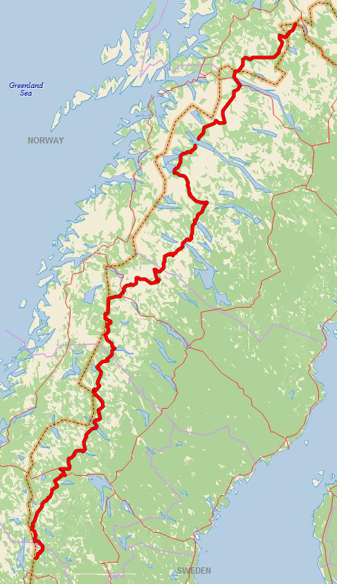

Gröna Bandet är inte en färdig utmärkt led utan man ska ta sig från Grövelsjön till Treriksröset (under Covid godkänns även Abisko eftersom sista delen går genom Norge). Efter vägen finns ett antal bestämda punkter som man måste passera väster om. Vill du läsa mer om Gröna Bandet och vilka regler som finns går det att göra på deras hemsida som finns här:  
[www.vitagronabandet.se](https://www.vitagronabandet.se)

Min planerade rutt ser ut såhär:

Jag har tänkt starta min vandring den 20/6 från Grövelsjön. I tabellen nedan ser ni de olika etapperna som går mellan olika provianteringspunkter. Jag har lite drygt 40 dagar på mig för min vandring vilket kommer bli tajt. Datumen är ungefärliga tider för när jag behöver vara vid de olika delmålen, men visar det sig att min plan är för agressiv för att ge en fin upplevelse kommer jag nog ganska snart skrota den och istället ta mig så långt som jag kommer. Det primära målet är ändå att få ett härligt äventyr och spendera en längre tid i vår fina fjällmiljö. 

Trycker man på Ortsnamnen får man fram den plottade rutten i Gaia GPS och kan studera den mer i detalj. Det går även ladda ner kml/gpx filer som innehåller all information om rutterna. Dessa brukar gå att ladda in i GPS enheter eller appar för att få samma information i en handhållen enhet som går att ha med på turen. För egen del kommer jag läsa in dessa i en Garmin InReach Mini, vilken är en mycket enkel GPS och nödsändare. 

| Etapp                                                        | Mil       | Höjdskillnad | Dagar   | Proviantering                                                | Kml                                              | Gpx                                              | ~Datum  |
| ------------------------------------------------------------ | --------- | ------------ | ------- | ------------------------------------------------------------ | ------------------------------------------------ | ------------------------------------------------ | ------- |
| Grövelsjön                                                   |           |              |         |                                                              |                                                  |                                                  | 20/6    |
| <a href="https://www.gaiagps.com/map/?loc=8.7/12.0413/62.3384&pubLink=wFQMgLunSAAnA75nwHCRLRhJ&trackId=566247c5-e825-4c16-a37d-b71c3cdf6c65" target="_blank">Hamra</a> | 8         | 3 426        | 3       | <a href="https://www.tanndalen.com/utforska/hamra-livs/" target="_blank">Hamra Livs</a> | [kml](./kmls/etapp-1-grovelsjon-hamra.kml)       | [gpx](./gpxs/etapp-1-grovelsjon-hamra.gpx)       | 22/6    |
| <a href="https://www.gaiagps.com/map/?loc=8.7/12.4826/62.3487&pubLink=BGfs8nMcgFnxVDENe9c68IqE&trackId=70fd4db8-a2e7-4dfe-b550-d915210fca60" target="_blank">Åre</a> | 15        | 6 151        | 6       | Flera möjligheter                                            | [kml](./kmls/etapp-2-hamra-are.kml)              | [gpx](./gpxs/etapp-2-hamra-are.gpx)              | 27-29/6 |
| <a href="https://www.gaiagps.com/map/?loc=8.3/13.2318/63.6800&pubLink=4Oi1wUXK9juDXVCOe9nSwcJY&trackId=99237973-961f-4c9a-b5d9-7f488256a3f3" target="_blank">Rötviken</a> | 13        | 3 827        | 4       | <a href="https://www.handlarn.se/butiker--oppettider/rotviken-follinge" target="_blank">Servicepunkt Handlarn</a> | [kml](./kmls/etapp-3-are-rotviken.kml)           | [gpx](./gpxs/etapp-3-are-rotviken.gpx)           | 2/7     |
| <a href="https://www.gaiagps.com/map/?loc=8.3/13.2318/63.6800&pubLink=wyw7Mim5o20Dt0EHgb04YTQc&trackId=1520f385-04fc-4408-944f-07bd31d471e0" target="_blank">Gäddede</a> | 9         | 2 604        | 3       | <a href="https://www.ica.se/butiker/nara/stromsund/gransbua-504/start/" target="_blank">Ica Gränsbua</a> | [kml](./kmls/etapp-4-rotviken-gaddede.kml)       | [gpx](./gpxs/etapp-4-rotviken-gaddede.gpx)       | 5/7     |
| <a href="https://www.gaiagps.com/map/?loc=8.3/14.0761/64.7793&pubLink=nIIXRK1ySiRQZ9Y7miuqA8GB&trackId=bf9d9234-aae2-487c-83d4-9822114cd34f" target="_blank">Klimpfjäll</a> | 10        | 3 258        | 3       | <a href="https://www.handlarn.se/butiker--oppettider/klimpfjall" target="_blank">Handlarn Klimpfjäll</a> | [kml](./kmls/etapp-5-gaddede-klimpfjall.kml)     | [gpx](./gpxs/etapp-5-gaddede-klimpfjall.gpx)     | 8/7     |
| <a href="https://www.gaiagps.com/map/?loc=8.3/14.0761/64.7793&pubLink=flSSKvlb4X18tIC3o5YgGQvr&trackId=17e73152-cd57-4f9d-b48b-1d23a5190d5c" target="_blank">Hemavan</a> | 13        | 4 440        | 5       | <a href="https://www.ica.se/butiker/nara/storuman/fjallboden-hemavan-253/start/" target="_blank">Ica Fjällboden</a> | [kml](./kmls/etapp-6-klimpfjall-hemavan.kml)     | [gpx](./gpxs/etapp-6-klimpfjall-hemavan.gpx)     | 13/7    |
| <a href="https://www.gaiagps.com/map/?loc=8.3/14.0761/64.7793&pubLink=flSSKvlb4X18tIC3o5YgGQvr&trackId=17e73152-cd57-4f9d-b48b-1d23a5190d5c" target="_blank">Ammarnäs</a> | 8         | 3 966        | 3       | <a href="https://ammarnaslivs.se/" target="_blank">Ammarnäs Livs</a> | [kml](./kmls/etapp-7-hemavan-ammarnas.kml)       | [gpx](./gpxs/etapp-7-hemavan-ammarnas.gpx)       | 16/7    |
| <a href="https://www.gaiagps.com/map/?loc=9.6/15.4938/65.9030&pubLink=zmfHAA8aNzDtcsSPEvyHHK7e&trackId=791e5ec2-0f7b-43df-ae29-e8ae1ee20860" target="_blank">Jäkkvik</a> | 9         | 2 960        | 3       | <a href="https://www.ica.se/butiker/nara/arjeplog/ica-nara-jackvik-16752/start" target="_blank">Ica Nära Jäckvik</a> | [kml](./kmls/etapp-8-ammarnas-jakkvik.kml)       | [gpx](./gpxs/etapp-8-ammarnas-jakkvik.gpx)       | 19/7    |
| <a href="https://www.gaiagps.com/map/?loc=8.2/16.9162/66.6674&pubLink=KZjcxScWiidMF5DzkFLXp2d6&trackId=f5be3050-d79e-4fe0-8d4b-562ddb546c95" target="_blank">Kvikjokk</a> | 9         | 3 205        | 3       | Skicka paket <a href="https://kvikkjokkfjallstation.se" target="_blank">Kvikkjokk Fjällstation</a> | [kml](./kmls/etapp-9-jakkvik-kvikkjokk.kml)      | [gpx](./gpxs/etapp-9-jakkvik-kvikkjokk.gpx)      | 22/7    |
| <a href="https://www.gaiagps.com/map/?loc=8.2/16.9162/66.6674&pubLink=KZjcxScWiidMF5DzkFLXp2d6&trackId=f5be3050-d79e-4fe0-8d4b-562ddb546c95" target="_blank">Stáloluokta</a> | 8         | 2 332        | 3       | Visst utbud: <a href="https://padjelanta.com/stugor/staloluokta/" target="_blank">https://padjelanta.com/stugor/staloluokta/</a> | [kml](./kmls/etapp-10-kvikkjokk-staloluokta.kml) | [gpx](./gpxs/etapp-10-kvikkjokk-staloluokta.gpx) | 25/7    |
| <a href="https://www.gaiagps.com/map/?loc=9.0/16.7741/67.4823&pubLink=7afJFqFIWLMF0Jmc2Jt1b1Rz&trackId=7918d459-b481-4cc5-a63d-e0e9603e7d85" target="_blank">Änonjalme</a> | 6         | 1 724        | 2       |                                                              | [kml](./kmls/etapp-11-staloluokta-anonjalme.kml) | [gpx](./gpxs/etapp-11-staloluokta-anonjalme.gpx) | 27/7    |
| Ritsem (Båt)                                                 | 0         | 0            | 0       | Skicka paket  <a href="https://www.svenskaturistforeningen.se/boende/stf-ritsem/" target="_blank">STF Ritsem</a> |                                                  |                                                  | 27/7    |
| <a href="https://www.gaiagps.com/map/?loc=9.0/16.7741/67.4823&pubLink=c4FHzirPoMaVX0ulAnYfcp4S&trackId=d66ed6de-3c5a-4cba-bf07-c9395a6797dc" target="_blank">Abisko</a> | 12        | 3 578        | 4       | <a href="http://www.godisfabriken.se/8-startsida/29-valkomna-till-abisko" target="_blank">Godisfabriken</a>   (Även mat, namnet till trotts) | [kml](./kmls/etapp-12-ritsem-abisko.kml)         | [gpx](./gpxs/etapp-12-ritsem-abisko.gpx)         | 31/7    |
| <a href="https://www.gaiagps.com/map/?loc=7.8/18.9967/68.7054&pubLink=CtNbmrlpOf1OPRAyefdWJ59i&trackId=533316ce-b581-4029-82f3-74531da3880b" target="_blank">(Treriksröset)</a> | 17        | 6 589        | X       |                                                              | [kml](./kmls/etapp-13-abisko-treriksroset.kml)   | [gpx](./gpxs/etapp-13-abisko-treriksroset.gpx)   | X       |
| Totalt                                                       | 120 (+17) |              | 42 (+X) |                                                              |                                                  |                                                  |         |
